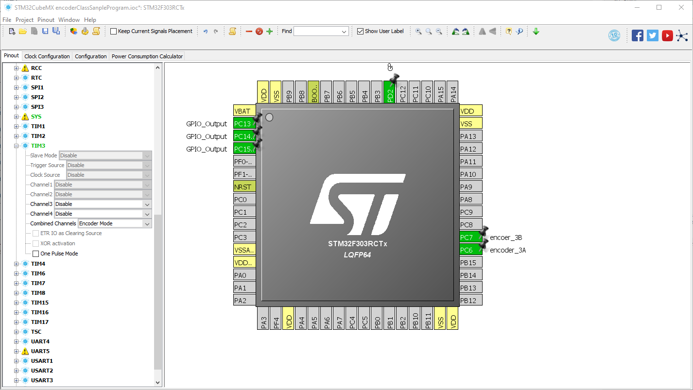

# 初めに
このクラスはエンコーダーの値を簡単に取得できるようにするために作成されました。

---
# CubeMXでの設定
## Pinout
   TIMx の**Conbined Channel**を**Encoder Mode**にする。  使用するピンを設定する(写真ではPC6,PC7をしよう)
   
##Configration
**CounterPeriod**を適当に設定する。(e.g.)PWMで設定した値にする。  
**EncoderMode**をA相,B相があるエンコーダー(e.g. AMT102,AMT103,etc)では**Encoder Mode TI1 and TI2**に設定する。  
カウントの方向は**Prrameter for Channel x**の片方の**Polarity**を変更することで変えられる。


---
# Encoder(TIM_HandleTypeDef *timer);
使用するタイマーを指定します。コンストラクタ内でメンバ変数の初期化も行っています。

---

# メンバ関数
メンバ関数の使用方法について解説しています。
## void init();
初期化に使用します。現段階で意味のある機能は実装されていません。初期化を実装した場合はここも更新してください。
## void start();
カウントを開始します。カウンタは初期化されません。前回値の続きからカウントします。
## void stop();
カウントを停止します。カウントの初期化は行いません。
## void update();
カウンタを更新します。この関数以外でカウンタが更新されることはありません。カウント中はループ毎にこの関数を呼び出してください。
## int32_t getCount();
現在のカウンタを返します。この関数を呼び出すする前にupdate()を呼び出してカウンタを更新してください。
## void resetCount();
カウンタを0に戻します。

---
# 使用例

```c:wrapper.hpp
#include"encoder.hpp"

Encoder encoder(&htim3);

void init(void){
	encoder.init();
	encoder.start();
}

void loop(){
	static int32_t count = 0; 
	encoder.update();
	count = encoder.getCount();
	if(resetCondition){
		encoder.resetCount();
	}
	if(endCondition){
		encoder.stop();
		break;
	}
}
```

---
2019/10/16 created by satoshi ohya(conatus.11099@gmail.com)
2019/10/c3 edited by satoshi ohya
